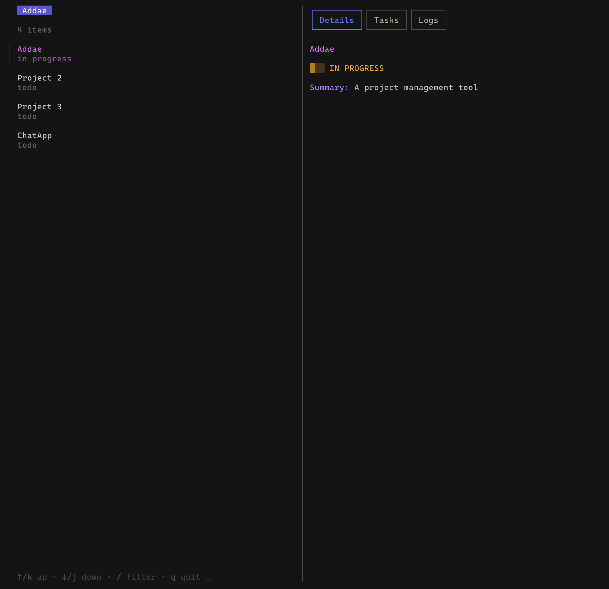
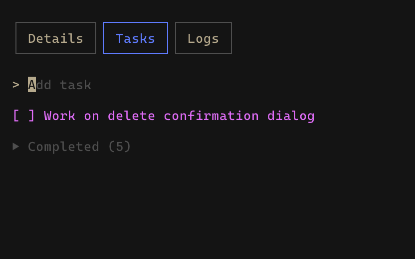
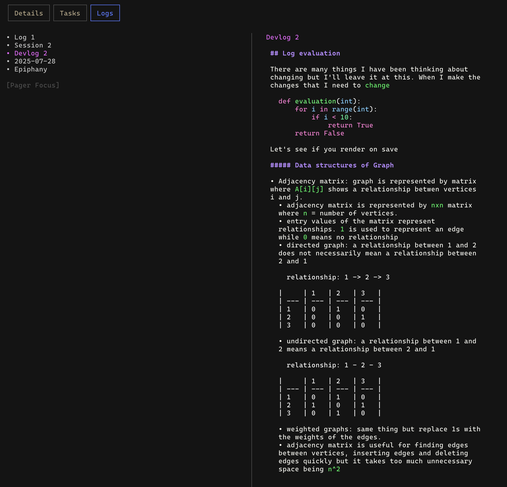
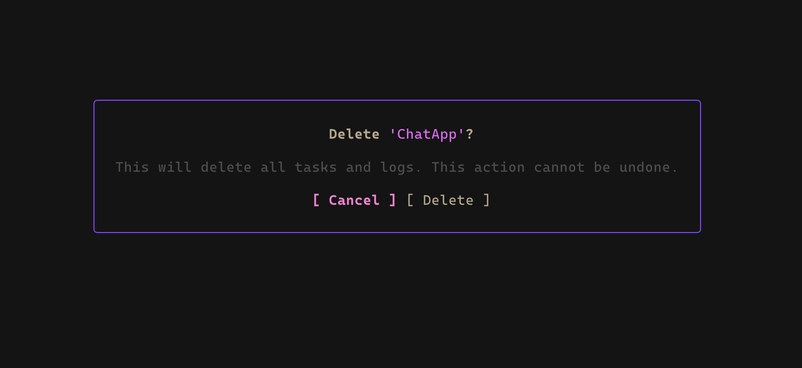

# ADDAE - A TUI Project Management Tool

[](https://golang.org)
[](https://opensource.org/licenses/MIT)
[](https://github.com/quamejnr/addae/actions)

**Addae** is a terminal-based project management tool designed to help you manage all your projects in one place. It provides a simple and efficient way to track projects, tasks, and development logs without leaving your terminal.


## 📸 Screenshots

<p align="center">
  
  <br>
  <em>Project List View: See all your projects at a glance.</em>
</p>

<p align="center">
  
  <br>
  <em>Task Management: Easily add, edit, and complete tasks.</em>
</p>

<p align="center">
  
  <br>
  <em>Log Editor: Write and view development logs with markdown support.</em>
</p>

<p align="center">
  
  <br>
  <em>Delete Project Dialog: Confirmation dialog for deleting projects.</em>
</p>

## ✨ Features

*   **Project Management:** Create, update, and delete projects with ease.
*   **Task Tracking:** Add, edit, and complete tasks for each project.
*   **Development Logs:** Keep a log of your development progress with markdown support.
*   **Vim Keybindings:** Navigate the application using familiar Vim keybindings.
*   **Multiple Views:** Switch between a project list, detailed project view, and task/log tabs.
*   **Status Indicators:** Quickly see the status of your projects (e.g., `TODO`, `In Progress`, `Completed`).

## 🚀 Installation

### From a Release

This is the recommended method for most users.

1.  Go to the [**Releases**](https://github.com/quamejnr/addae/releases) page.
2.  Download the appropriate binary for your operating system and architecture (e.g., `addae-linux-amd64`, `addae-darwin-amd64`, `addae-windows-amd64.exe`).
3.  (Optional but recommended) Move the binary to a directory in your system's `PATH` for easy access from anywhere. For example:
    ```bash
    # For Linux/macOS
    mv ./addae-darwin-amd64 /usr/local/bin/addae
    
    # Make it executable
    chmod +x /usr/local/bin/addae
    ```
4.  Run `addae` from your terminal.

### From Source (for developers)

If you have Go installed, you can build `addae` from the source code.

```bash
go install github.com/quamejnr/addae@latest
```

## ⌨️ Keybindings

Addae uses Vim-style keybindings for navigation. Here are the most common commands:

| Key              | Action                  |
| ---------------- | ----------------------- |
| `↑` / `k`        | Move up                 |
| `↓` / `j`        | Move down               |
| `←` / `ctrl+h`   | Previous tab            |
| `→` / `ctrl+l`   | Next tab                |
| `1`              | Show details            |
| `2`              | Show tasks              |
| `3`              | Show logs               |
| `enter`          | Select object           |
| `n`              | Create object           |
| `t`              | Create task             |
| `l`              | Create log              |
| `d`              | Delete object           |
| `u`              | Update project          |
| `e`              | Edit                    |
| `space`          | Toggle done             |
| `c`              | Toggle completed        |
| `tab`            | Switch focus            |
| `?`              | Toggle help             |
| `esc` / `b` / `ctrl+c`| Back                    |

## 🤝 Contributing

Contributions, issues, and feature requests are welcome! Feel free to check the [issues page](https://github.com/quamejnr/addae/issues).

## 📜 License

This project is licensed under the MIT License - see the [LICENSE.md](LICENSE.md) file for details.
